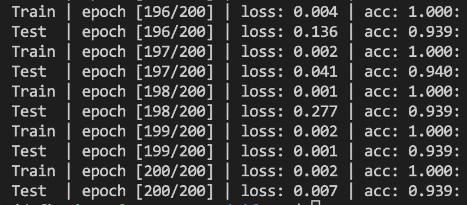

## 小型实验记录 - ResNet

#### 模型

模型的搭建完全按照 <a href="https://arxiv.org/abs/1512.03385">Deep Residual Learning for Image Recognition</a> 中的4.2节进行，选取的网络是论文中的ResNet-110（即 $n=18$ ），首先会经过一层卷积层与batch norm，然后依次经过3个layer，每个layer有36层卷积层，且后两个layer的第一层卷积层用于压缩大小（直接用 $1\times1$ 的卷积核，`stride=2` 的卷积层进行），不断缩小图片，最后经过一层average池化+一层full connected得到最终的预测结果（10维tensor）。loss采用cross entropy。

#### 实验结果

首先，我没有完全按照论文进行超参调整，沿用了我之前做mnist时的一些超参数（`batch_size=64`，`normalization` 是一维的，没有进行data augmentation与weight initialization），优化器采用Adam（`lr=1e-3`，`weight_decay=0`），跑100个epoch，最终训练集的acc趋于100%（overfitting），测试集的acc收敛在80%左右，效果不是很好。

然后，我根据论文进行了一定调整，首先超参完全与论文一致，设置`batch_size=128`，优化器采用SGD（初始 `lr=0.1`，`weight_decay=1e-4`，`momentum=0.9`），学习率仅在经过32k与48k步之后除以10（这点没有与论文完全一致），然后还进行了随机裁剪与随机水平翻转的数据增强，normalization也改成了三维，没有进行weight initialization。跑200个epoch，最后的结果比较意外：训练集和测试集的acc都收敛在**10%**，loss集中在2.3左右且无法下降，说明模型未收敛，但原因不明。

一开始我认为可能是初始 `lr` 过大，因此将初始的 `lr` 直接修改为1e-3，最终acc成功收敛到88.3%。但将model直接换为resnet18（`from torchvision.models.resnet import resnet18`）后发现即使初始 `lr` 为0.1，模型可以成功收敛到acc 大于10%，因此猜测是模型的问题。仔细审查论文之后，发现我没有做**weight initialization**的工作，查阅资料后发现原论文使用的weight initialization的方法是Kaiming He采用的方法，将其运用于所有卷积层与全连接层后（本来最后一层之前的avgpool直接采用的是 `torch.nn.functional` 中的 `AvgPool2d`，这一版将其加入了网络之中，使用的是 `torch.nn.AdaptiveAvgPool2d`，但这一改动貌似关系不大），测试集acc成功收敛到91.3%，说明<u>weight initialization可能会对实验的结果产生显著的影响</u>。

> 比较有趣的是，我在网上也查到pytorch的神经网络默认采用kaiming初始化，不过我把初始化前后的网络层参数进行输出，发现参数还是存在不同，说明我可能采用了二次kaiming初始化的策略，不知道为什么这对结果是否收敛产生了巨大的影响。

再次与论文对比，发现自己对 `lr` 的处理策略还存在一定问题，原论文在一开始先采用了1e-2的学习率以warmup，待acc达到20%以上再调整为0.1，进而采用先前的递降策略。这或许可以解释之前在未进行合适的初始化时模型无法收敛的现象。采用这一warmup策略（节点设为1k次迭代），最终测试集acc成功收敛到93.9%（在120个epoch左右便收敛到这一值），大致完成了94%的目标。

> 有趣的是，在32k次迭代的节点（`lr` 从0.1变化到0.01的节点，第82个epoch），测试集的acc直接从86.9%提升到92.2%，这说明 `lr` 的突降确实可能带来模型性能的提升，帮助其跳出局部最优点。在48k次迭代的节点（`lr` 从1e-2到1e-3到节点）测试集的acc没有显著变化。

如果想要进一步提升acc，可能可以改变学习率变化策略、对模型进行适度加深、调参等等。<a href="https://arxiv.org/pdf/2206.13424v3.pdf">Benchopt: Reproducible, efficient and collaborative optimization benchmarks</a> 利用resnet18做到了95%以上的acc。
